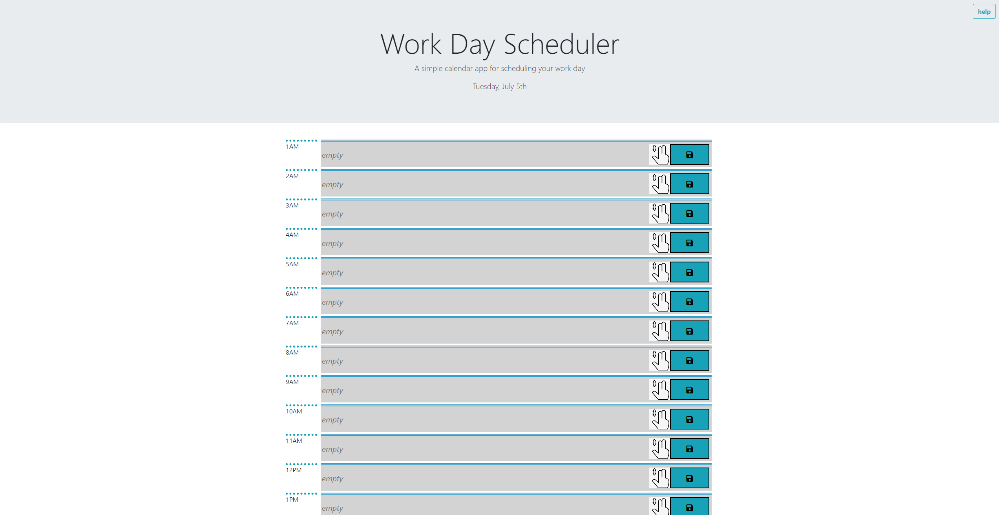
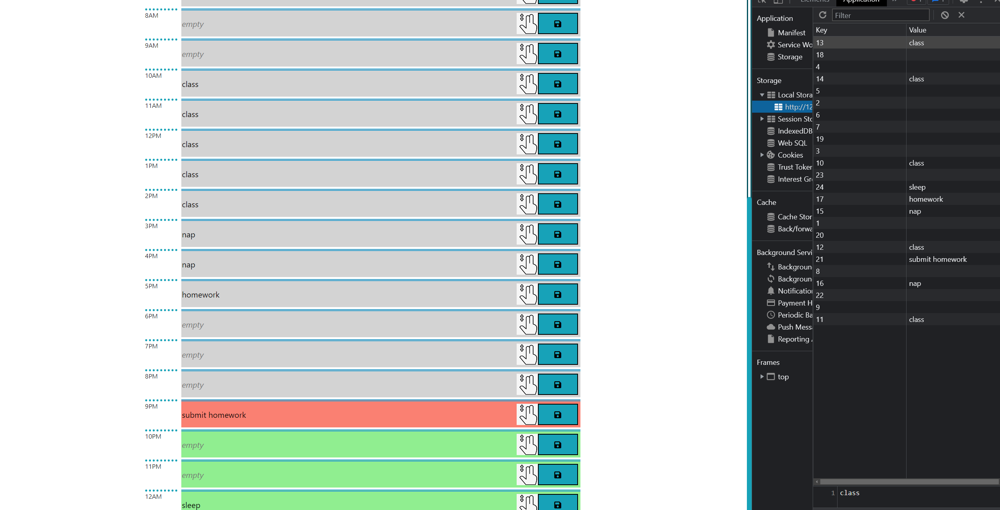

# Daily-Scheduler
### Short Description
This project started with minimum scafolding. It is meant to imitate google calender's hourly scheduling. 

### Deployed GH-Page
Link: https://danthedev-zsh.github.io/Daily-Scheduler/

## Screenshots

### Note
There is a bug where if you drag a tile to a random block, the save button will be broken trying to save a null event.target
